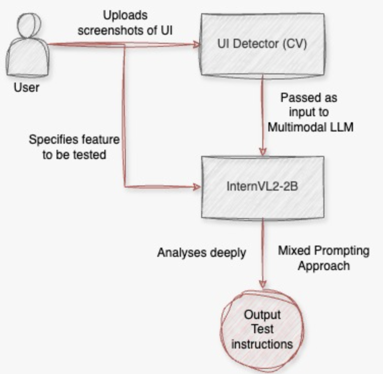

# Multimodal LLM (MLLM) UI Test Case Generator 

## Overview

This project addresses the problem of generating detailed test cases for digital product features based on screenshots. The tool uses a combination of advanced models and a user-friendly front end to achieve this goal.

## Flow 



## Frontend

The front end is built using [Gradio](https://gradio.app/), providing a simple and intuitive interface for users. Key features include:

- **Text Box**: For optional context.
- **Multi-Image Uploader**: For uploading screenshots.
- **Buttons**: To trigger image processing and test case generation.

## Backend

The backend integrates two primary models:

### 1. UI-Detector Computer Vision Project from Roboflow

- **Purpose**: Detects and annotates UI elements in screenshots.
- **Usage**: Processes images to identify and highlight various UI components.

### 2. OpenGVLab/InternVL2-2B

- **Purpose**: Generates detailed test cases based on the processed images and optional text context.
- **Usage**: Receives annotated images and a mixed-approach prompt to produce comprehensive test case descriptions.

### Mixed Approach Prompt

The tool utilizes a mixed approach to prompt the model effectively, combining the visual information from the UI-Detector with contextual text to generate accurate and useful test cases.

## How It Works

1. **Image Upload**: Users upload screenshots through the Gradio interface.
2. **UI Detection**: The UI-Detector model processes the images to detect and highlight UI elements.
3. **Image Preprocessing**: Screenshots are preprocessed into a format suitable for the MLLM.
4. **Test Case Generation**: The OpenGVLab/InternVL2-2B model, guided by a mixed-approach prompt, generates detailed test cases based on the processed images and context.

## Installation

To install the required dependencies, use:

```bash
pip install -r requirements.txt
